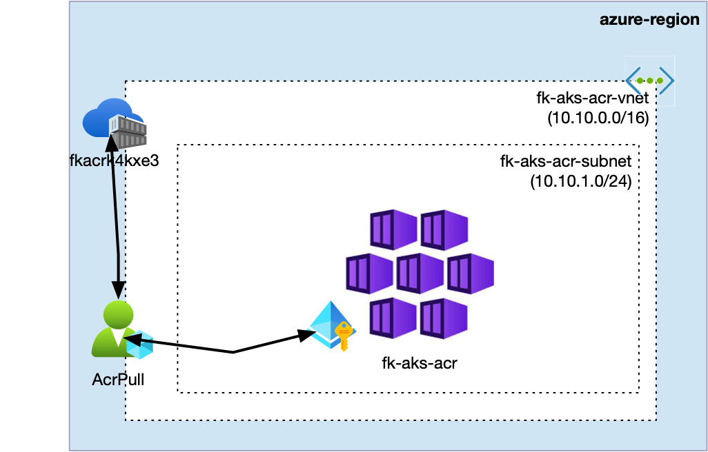
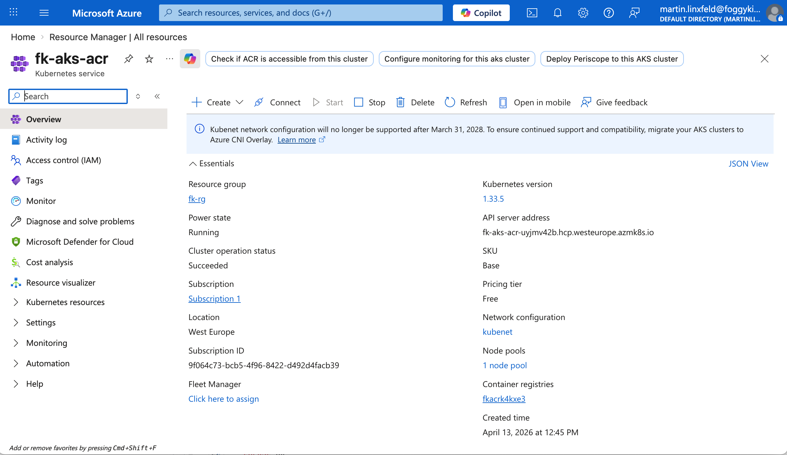
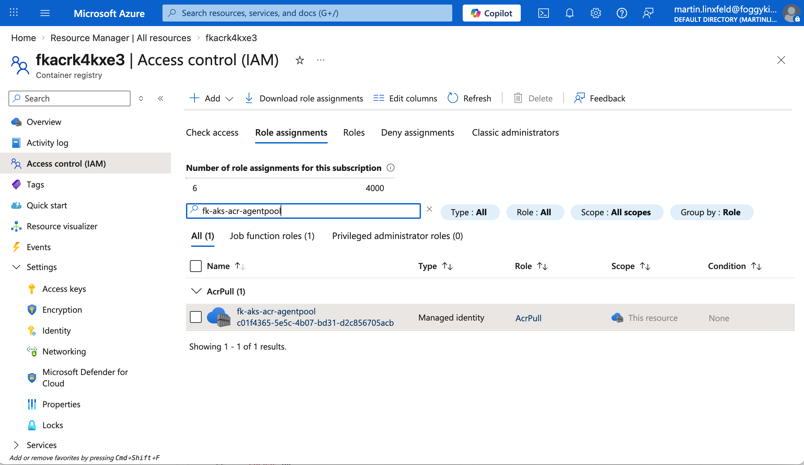

# Example 02: AKS With ACR Attach

In this RBAC example, we connect an **Azure Kubernetes Service (AKS)** cluster
to an **Azure Container Registry (ACR)** using an explicit Azure role assignment.

This example focuses on **authorization wiring**:

- ACR is created by the dedicated `terraform-az-fk-acr` module
- AKS is created by the dedicated `terraform-az-fk-aks` module
- RBAC is created by the dedicated `terraform-az-fk-rbac` module
- the AKS kubelet identity receives **AcrPull** on the ACR scope

This is an **RBAC integration example**, not a full platform baseline.

---

## 🧭 Architecture Overview

This deployment creates:

- One **Resource Group**
- One **Azure Container Registry**
- One **Azure Kubernetes Service** cluster
- One **RBAC role assignment** via `terraform-az-fk-rbac`



The AKS kubelet identity becomes the RBAC principal.
The ACR resource becomes the RBAC scope.
The dedicated RBAC module connects both with the **AcrPull** role.

---

## 🎯 Why this example exists

This example shows how authorization should stay **separate and explicit**
instead of being hidden inside compute or registry modules.

It focuses on:

- understanding how the AKS kubelet identity becomes the principal
- understanding how ACR becomes the authorization scope
- composing three dedicated modules together
- keeping AKS-to-ACR access readable and reusable

This is the natural next step after the VM-to-Storage example:
the same RBAC module is now reused for a **container platform** scenario.

---

## 🚀 Deployment Steps

From the `examples/02_aks_with_acr_attach` directory:

```bash
cp terraform.tfvars.example terraform.tfvars
tofu init
tofu plan
tofu apply
```

---

## ✅ Validation

After `tofu apply`, you can verify the resources and the role assignment:

```bash
RESOURCE_GROUP_NAME="$(tofu output -raw resource_group_name)"
ACR_NAME="$(tofu output -raw acr_name)"
AKS_NAME="$(tofu output -raw aks_cluster_name)"
ACR_ID="$(tofu output -raw acr_id)"

az acr show \
  --resource-group "${RESOURCE_GROUP_NAME}" \
  --name "${ACR_NAME}" \
  --query "{name:name, loginServer:loginServer, sku:sku.name, provisioningState:provisioningState}" \
  --output json

az aks show \
  --resource-group "${RESOURCE_GROUP_NAME}" \
  --name "${AKS_NAME}" \
  --query "{name:name, provisioningState:provisioningState, kubernetesVersion:kubernetesVersion, nodeResourceGroup:nodeResourceGroup}" \
  --output json

az role assignment list \
  --scope "${ACR_ID}" \
  --query "[].{role:roleDefinitionName, principalId:principalId}" \
  --output table
```

The expected result is:

- ACR in `Succeeded` state
- AKS in `Succeeded` state
- an **AcrPull** assignment for the AKS kubelet identity on the created ACR

---

## 🖼️ Azure Portal View



*Figure 1. AKS overview showing the cluster in `Succeeded` state and the attached container registry.*



*Figure 2. ACR `Access control (IAM)` showing the explicit `AcrPull` assignment on the registry scope.*


*Figure 3. AKS agent pool managed identity with object ID matching the principal used by the RBAC module.*

---

## 🔧 Key RBAC Wiring

```hcl
module "rbac" {
  source = "github.com/mlinxfeld/terraform-az-fk-rbac"

  scope                = module.acr.acr_id
  principal_id         = module.aks.kubelet_object_id
  role_definition_name = "AcrPull"
}
```

---

## 🧹 Cleanup

```bash
tofu destroy
```

---

## 🪪 License

Licensed under the **Universal Permissive License (UPL), Version 1.0**.  
See [LICENSE](../../LICENSE) for details.
