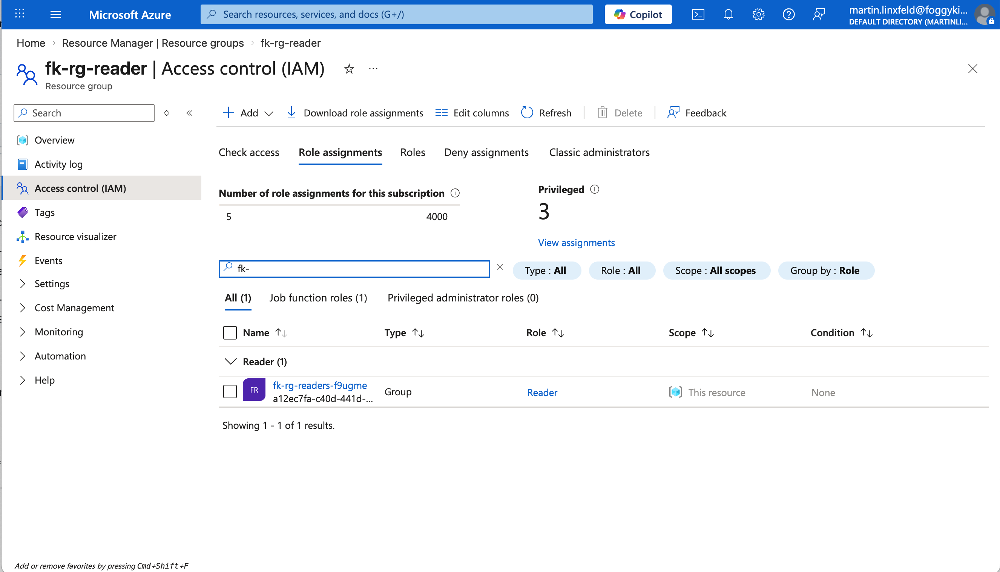
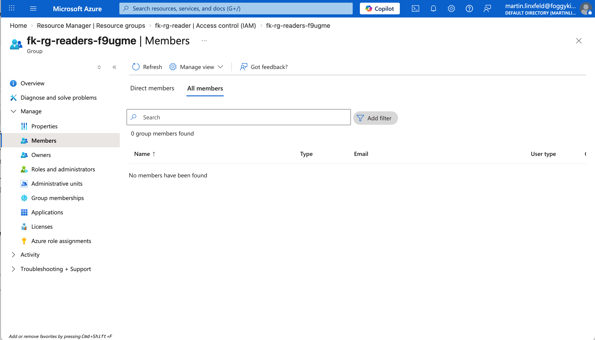

# Example 03: Group Reader On Resource Group

In this RBAC example, we create an **empty Entra ID security group**
and assign it the built-in **Reader** role on an **Azure Resource Group** scope.

In practical terms, this means:

- the group can be used later for Azure users who should only inspect resources
- members of that group will be able to **view** resources in the Resource Group
- members of that group will **not** be able to modify or delete resources
- this example does **not** create a test user; access starts only after you add existing users to the group

This example is intentionally minimal:

- the principal is an empty Entra ID group created by the `azuread` provider
- the scope is a plain Azure Resource Group
- the role assignment is created by the dedicated `terraform-az-fk-rbac` module
- no test user is created in Entra ID as part of this example

This is a **pure RBAC composition example** with almost no surrounding infrastructure.

---

## 🧭 Architecture Overview

This deployment creates:

- One **Entra ID security group**
- One **Azure Resource Group**
- One **RBAC role assignment** via `terraform-az-fk-rbac`

The security group starts empty.
The Resource Group becomes the RBAC scope.
The RBAC module connects both using the built-in **Reader** role.

The end result is simple:

- the group has read-only access to the whole Resource Group
- the group cannot create, modify, or delete resources there

---

## 🎯 Why this example exists

The first two examples focus on managed identities attached to workloads.
This example shows a different and very common RBAC pattern:

- the principal is **not** a VM or AKS identity
- the scope is **not** a single service resource such as Storage or ACR
- the role assignment still uses the exact same RBAC module contract

This makes the example useful as the most direct demonstration of what this module really does:

- create a principal
- define a scope
- attach a role

In other words:
this example shows how to prepare a clean **read-only access group**
for one Azure Resource Group.

---

## 🚀 Deployment Steps

From the `examples/03_group_to_resource_group_reader` directory:

```bash
cp terraform.tfvars.example terraform.tfvars
tofu init
tofu plan
tofu apply
```

---

## ✅ Validation

After `tofu apply`, you can verify the group, scope, and role assignment:

```bash
RESOURCE_GROUP_NAME="$(tofu output -raw resource_group_name)"
RESOURCE_GROUP_ID="$(tofu output -raw resource_group_id)"
GROUP_DISPLAY_NAME="$(tofu output -raw group_display_name)"
GROUP_OBJECT_ID="$(tofu output -raw group_object_id)"

az group show \
  --name "${RESOURCE_GROUP_NAME}" \
  --query "{name:name, location:location, id:id}" \
  --output json

az ad group show \
  --group "${GROUP_OBJECT_ID}" \
  --query "{displayName:displayName, id:id, securityEnabled:securityEnabled}" \
  --output json

az role assignment list \
  --scope "${RESOURCE_GROUP_ID}" \
  --query "[?principalId=='${GROUP_OBJECT_ID}'].{role:roleDefinitionName, principalId:principalId, scope:scope}" \
  --output table
```

The expected result is:

- the Resource Group exists in `Succeeded` state
- the Entra ID security group exists and is initially empty
- the group has the **Reader** role on the created Resource Group
- users added later to that group will be able to view resources, but not change or delete them

---

## 🖼️ Azure Portal View



*Figure 1. The Entra ID security group has the `Reader` role assigned on the `fk-rg-reader` Resource Group scope.*



*Figure 2. The group starts empty; access is inherited only after existing users are added as members.*

---

## 🔧 Key RBAC Wiring

```hcl
module "rbac" {
  source = "github.com/mlinxfeld/terraform-az-fk-rbac"

  scope                = azurerm_resource_group.foggykitchen_rg.id
  principal_id         = azuread_group.readers.object_id
  role_definition_name = "Reader"
}
```

---

## 🧹 Cleanup

```bash
tofu destroy
```

---

## 🪪 License

Licensed under the **Universal Permissive License (UPL), Version 1.0**.  
See [LICENSE](../../LICENSE) for details.
